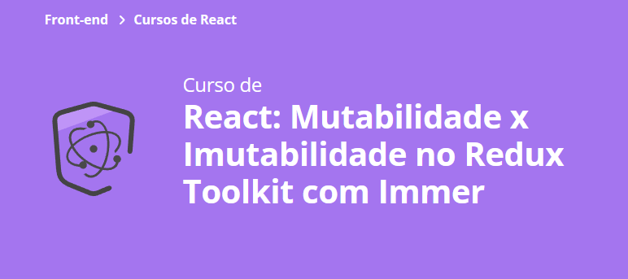

# Site Trato Tech Redux Immer
- JavaScipt
- Criação de componentes e pages
- CSS modules
- React Router
- React Redux
- ReduxJS Toolkit
- React Hook Form

#### Vercel Pages: em breve

### Aula 1:
- Criando a rota anuncie :white_check_mark:
### Aula 2:
- Utilizar o react-hook-form para controlar campos de um formulário de forma simples e rápida; :white_check_mark:
- Como reaproveitar estilos extraindo componentes quando necessário; :white_check_mark:
- Como o register e o handleSubmit funcionam. :white_check_mark:
### Aula 3:
- Como criar validações com react-hook-form; :white_check_mark:
- Como utilizar inúmeras funcionalidades do Redux Devtools; :white_check_mark:
- O que é mutabilidade; :white_check_mark:
- O que é referência e o que isso tem a ver com React e com renderizações desnecessárias. :white_check_mark:
### Aula 4:
- O que é Immer; :white_check_mark:
- Como a imutabilidade funciona; :white_check_mark:
- Quais benefícios a Imutabilidade nos traz; :white_check_mark:
- Porque o spread operator não resolve dados complexos dentro de dados complexos. :white_check_mark:
### Aula 5:
- 
### Aula 6:
- 

# Getting Started with Create React App

This project was bootstrapped with [Create React App](https://github.com/facebook/create-react-app).

## Available Scripts

In the project directory, you can run:

### `yarn start`

Runs the app in the development mode.\
Open [http://localhost:3000](http://localhost:3000) to view it in your browser.

The page will reload when you make changes.\
You may also see any lint errors in the console.

### `yarn test`

Launches the test runner in the interactive watch mode.\
See the section about [running tests](https://facebook.github.io/create-react-app/docs/running-tests) for more information.

### `yarn build`

Builds the app for production to the `build` folder.\
It correctly bundles React in production mode and optimizes the build for the best performance.

The build is minified and the filenames include the hashes.\
Your app is ready to be deployed!

See the section about [deployment](https://facebook.github.io/create-react-app/docs/deployment) for more information.

## Learn More

You can learn more in the [Create React App documentation](https://facebook.github.io/create-react-app/docs/getting-started).

To learn React, check out the [React documentation](https://reactjs.org/).

### Advanced Configuration

This section has moved here: [https://facebook.github.io/create-react-app/docs/advanced-configuration](https://facebook.github.io/create-react-app/docs/advanced-configuration)

### Deployment

This section has moved here: [https://facebook.github.io/create-react-app/docs/deployment](https://facebook.github.io/create-react-app/docs/deployment)

### `yarn build` fails to minify

This section has moved here: [https://facebook.github.io/create-react-app/docs/troubleshooting#npm-run-build-fails-to-minify](https://facebook.github.io/create-react-app/docs/troubleshooting#npm-run-build-fails-to-minify)
